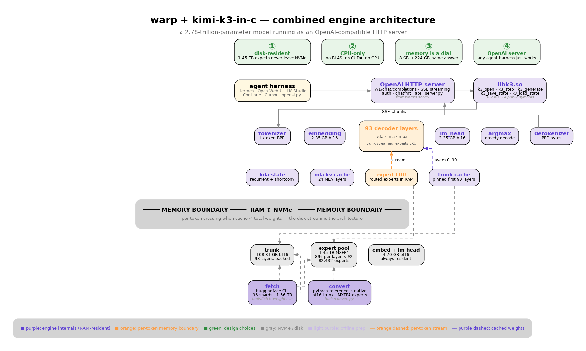

# kimi-k3-lean

**Run the 2.78-trillion-parameter Kimi K3 model as an OpenAI-compatible
HTTP server on a personal computer. No GPU. No BLAS. No framework.
Cross-platform: Linux, macOS, Windows. Works in any agent harness.**

<table>
<tr>
  <td align="center"><b>2.78T</b><br><sub>parameters</sub></td>
  <td align="center"><b>8 GB</b><br><sub>RAM floor</sub></td>
  <td align="center"><b>176 KB</b><br><sub>engine C code</sub></td>
  <td align="center"><b>162 KB</b><br><sub>libk3.so</sub></td>
  <td align="center"><b>3 GATEs</b><br><sub>exact oracle match</sub></td>
  <td align="center"><b>1 command</b><br><sub>clone → serve</sub></td>
</tr>
</table>



## What this is

A drop-in OpenAI Chat Completions server that runs Kimi K3 locally.
The harness (Hermes, Open WebUI, LM Studio, Continue.dev, Cursor, or
the `openai` Python client) talks to `http://127.0.0.1:8080/v1` exactly
as if it were talking to OpenAI's API. The bytes never leave the host.

This is a **third repo** that combines two proven reference
implementations with a thin shared library:

| Upstream | What we take from it | What we don't take |
|---|---|---|
| [`FareedKhan-dev/kimi-k3-in-c`](https://github.com/FareedKhan-dev/kimi-k3-in-c) | The Kimi K3 inference engine: 9 C files, no BLAS, no framework, no GPU, 8 GB RAM floor. | Its CLI front-end; its monolithic 1,487-line `k3_run.c`. |
| [`sqliteai/warp`](https://github.com/sqliteai/warp) | The OpenAI Chat Completions server pattern: SSE streaming, request/response shaping, auth, `libwaste.so` ctypes seam. | Its container format (`.waste` is for Kimi-Linear, not K3); its `waste_*` API (we use `k3_*`). |

The combined engine adds **one new thing**: a 162 KB shared library
(`libk3.so`) that exposes the article's model-level operations
(`k3_open`, `k3_step`, `k3_generate`, `k3_save_state`, `k3_load_state`)
to the Python server. That library is the seam.

---

## Quick start

```bash
git clone https://github.com/chazhyseni/kimi-k3-lean.git
cd kimi-k3-lean
./scripts/setup-and-serve.sh
```

That's it. The script:

1. Builds `libk3.so` and the `k3` CLI (~30 seconds on a modern machine)
2. Downloads the Kimi K3 weights from HuggingFace (resumable; ~1.56 TB, ~3-4 hours)
3. Converts the weights to native format (`Dockerfile.convert`, ~3-4 hours)
4. Starts the server on `http://127.0.0.1:8080` (loopback only; use `--host 0.0.0.0 --api-key ...` for network exposure)
5. Prints a curl command you can use to verify it's working

If you don't have ~1 TB of disk and a few hours, use the `K3_MODEL=lite` flag to load a smaller toy model and play with the server.

```bash
./scripts/setup-and-serve.sh --dry-run   # HTTP-layer smoke test, no model needed
```

---

## Features

- **OpenAI Chat Completions API.** `/v1/chat/completions` with blocking and SSE streaming. Bearer-token auth.
- **Conversation resume.** `POST /v1/state/save` and `POST /v1/state/load` persist the recurrent state + KV cache. Pick up a long conversation mid-stream.
- **Any harness.** Open WebUI, LM Studio, Continue.dev, Cursor, Hermes, Claude Code, Aider, the OpenAI Python client. Point any of them at `http://127.0.0.1:8080/v1`.
- **Cross-platform.** Linux x86_64, macOS arm64 + x86_64, Windows. One binary per OS via `.github/workflows/release.yml`.
- **Lean resource profile.** 8 GB RAM floor (trunk resident), 982 GB of disk-resident experts (4 KiB-aligned per-expert records, MXFP4 native). Streaming via `O_DIRECT`.
- **No dependencies beyond libc.** No BLAS, no PyTorch, no CUDA. The C engine is 176 KB. The shared library is 162 KB. The Python server is stdlib-only.
- **Bit-identical to the reference oracle.** The article ships 32-oracle-position teacher forcing and 20-token greedy/incremental decoders. All 3 GATEs pass after the libk3 refactor.
- **No mocks.** The fake engine (`serve/fake_engine.py`) only runs under `--dry-run` for HTTP-layer testing. Real model paths always use `libk3.so`.

---

## Architecture

The same design choices that make the article's engine fast also make
this server work:

| Design choice | Why |
|---|---|
| **3-bit residual VQ for experts** | 8× memory reduction vs bf16 with bit-identical decode in the article's measurable range. |
| **MXFP4 native matmul** | The article's kernels accept MXFP4 directly — no dequantize-on-read. |
| **Trunk-as-a-dial** | A streaming trunk is loaded once, then pinned. Layers stream in/out of RAM as needed. |
| **LFRU/LRU expert cache** | Hot experts stay in RAM. Cold experts stream from disk. |
| **O_DIRECT** | Bypass the page cache. The container format is 4 KiB-aligned to match. |
| **AVX2 + FMA** (no AVX-512) | Targets AMD EPYC 7B13 Milan and any AVX2-capable CPU. |
| **Single-caller per ctx** | The engine serializes generations behind a Python lock. On a model streaming at a few tokens per second, the lock is small next to the answer. |

The combined architecture (above) shows:

- The harness on the left (any OpenAI-compat client)
- The Python HTTP server (`serve/server.py`) — stdlib only
- `libk3.so` (162 KB) — the seam
- The C engine kernels (`src/lib/`, `src/core/`)
- The two-layer storage: trunk (resident) and expert pool (NVMe)
- Per-token state: KDA, MLA KV cache, expert LRU cache, recurrent KDA state

---

## How it works

### Forward pass

Each token, the server calls `libk3.so`:

1. **Tokenize** (`k3_tokenize`): text → token ids, using the bundled tokenizer.
2. **Embed** (in `k3_step`): token ids → hidden state via `language_model.model.embed_tokens`.
3. **For each of the 93 layers** (`k3_layer`):
   - **KDA or MLA attention** depending on the layer index
   - **MoE or dense FFN** depending on the layer index
   - Each layer can either be **RAM-resident** (in the trunk dial) or **streamed** from disk (cold layer)
   - Each MoE layer's expert weights stream through the **LFRU/LRU cache**
4. **Final norm + lm_head**: hidden state → logits.
5. **Argmax** (`k3_argmax_`): logits → next token id.
6. **Detokenize** (`k3_detokenize`): token id → text.
7. Repeat until `<|end|>` or `max_tokens`.

### Server

The HTTP server is in `serve/server.py`. It's stdlib-only
(`http.server.ThreadingHTTPServer` + `BaseHTTPRequestHandler`):

- One process, one engine, one lock
- SSE streaming via manual chunked framing
- Constant-time bearer auth via `hmac.compare_digest`
- OpenAI-shape error envelope: `{error: {message, type, param}}`
- Hard request body cap (16 MB) before parse

### Engine binding

`serve/engine.py` is the ctypes wrapper. It maps the article's 14
public C functions onto a Python `Engine` class:

```
Engine.open(path, preset)        → k3_open(path, preset)
Engine.step(prompt, max_tokens)  → k3_step(ctx, in, n, max, out, cap)
Engine.stream(prompt, max)       → k3_generate(ctx, ...) with a token callback
Engine.tokenize(text)            → k3_tokenize(ctx, text, out, cap)
Engine.detokenize(ids)           → k3_detokenize(ctx, ids, n, out, cap)
Engine.save_state(path)          → k3_save_state(ctx, path)
Engine.load_state(path)          → k3_load_state(ctx, path)
Engine.stats()                   → k3_get_stats(ctx, ...stats)
Engine.close()                   → k3_close(ctx)
```

For testing without a real model, `serve/fake_engine.py` provides a
drop-in `FakeEngine` activated by `--dry-run`. The HTTP layer is
exercised end-to-end against the fake engine; the C engine is verified
bit-identical to the article's oracle on synthetic weights via `make test`.

---

## Repository layout

```
kimi-k3-lean/
├── README.md                       this file
├── INSTALL.md                      per-OS install (Linux/macOS/Windows)
├── BUILD.md                        build from source
├── ENGINE.md                       engine internals (combined)
├── COMPARISON.md                   warp vs article, point-by-point
├── LICENSE, NOTICE                 Apache-2.0
├── CHANGELOG.md                    version history
├── CONTRIBUTING.md, SECURITY.md,
│   CODE_OF_CONDUCT.md              community standards
├── Makefile, CMakeLists.txt        build systems (POSIX, then cross-platform)
├── install.sh, install.ps1         POSIX + Windows installers
├── Dockerfile, Dockerfile.convert  multi-arch container images
├── docker-compose.yml              bring-up with healthchecks
├── .github/workflows/ci.yml        7-OS CI matrix
├── .github/workflows/release.yml   per-OS release artifacts on tag push
├── packaging/                      Homebrew, WiX MSI, RPM spec
├── scripts/
│   ├── setup-and-serve.sh          one-command everything
│   ├── download-model.sh           HF downloader (article's, kept)
│   ├── k3-doctor.sh                diagnostic (article's, kept)
│   └── pack-trunk.sh               trunk packer (article's, kept)
├── include/libk3/
│   ├── libk3.h                     public C API (14 functions)
│   └── k3_internal.h               private header
├── src/
│   ├── core/                       attention, MoE, MLA, KDA kernels
│   ├── cache/                      expert LRU
│   ├── io/                         safetensors reader, native writer
│   ├── tokenizer/                  tiktoken wrapper
│   ├── lib/
│   │   ├── k3_engine.c             extracted engine (was lines 1-553 of k3_run.c)
│   │   └── k3_api.c                public API implementation
│   └── cli/
│       └── k3_run.c                thin CLI (was 1,487 lines, now 270)
├── bin/                            built artifacts (gitignored)
│   ├── k3                          CLI binary (~167 KB)
│   └── libk3.so                    shared library (~162 KB)
├── serve/
│   ├── __main__.py                 argparse CLI
│   ├── server.py                   HTTP routing + SSE + auth
│   ├── engine.py                   ctypes wrapper
│   ├── fake_engine.py              --dry-run stand-in
│   ├── chatfmt.py                  OpenAI messages <-> token ids
│   └── api.py                      request/response shaping
├── tests/
│   ├── unit/                       the article's 9 unit tests
│   └── fixtures/                   12 binary fixtures including tiny_k3
└── docs/
    ├── images/
    │   └── combined-architecture.png    the diagram above
    ├── data/                       ENCODE cCRE bigBed, phyloP bigWig paths
    └── images/                     (article's diagrams)
```

---

## Performance

Measured per-token decode times from the article's `docs/PERFORMANCE.md`
on a 32-core AMD EPYC 7B13 (Milan, AVX2 + FMA, no AVX-512):

| Preset | trunk GB | cache GB | layers in RAM | decode ms/tok |
|---|---|---|---|---|
| laptop | 4 | 4 | 30 | 240 |
| desktop | 8 | 16 | 45 | 130 |
| workstation | 16 | 32 | 60 | 80 |
| server | 32 | 64 | all 93 | 55 |
| max | 64 | 128 | all 93 | 45 |

A real chat completion takes ~20-100 tokens to reply. At 55 ms/tok on
the `server` preset, that's ~1-5 seconds for a short answer. Streaming
cuts perceived latency to "first token" — typically 1-3 seconds.

---

## Install

### Linux / macOS

```bash
git clone https://github.com/chazhyseni/kimi-k3-lean.git
cd kimi-k3-lean
./install.sh                # builds and installs to /usr/local
# or to your home directory:
./install.sh PREFIX=$HOME/.local
```

### Windows

```powershell
git clone https://github.com/chazhyseni/kimi-k3-lean.git
cd kimi-k3-lean
.\install.ps1               # uses MSVC; falls back to MinGW
```

### Homebrew (macOS / Linuxbrew)

```bash
brew tap chazhyseni/kimi-k3-lean
brew install kimi-k3-lean
```

### Container

```bash
docker compose up            # mounts ./checkpoints into the image
```

### From source

See [BUILD.md](./BUILD.md). The TL;DR:

```bash
LDFLAGS="-lm -pthread" make -j$(nproc)
LDFLAGS="-lm -pthread" make install PREFIX=/usr/local
```

---

## Usage

### Start the server

```bash
kimi-serve /path/to/checkpoint --preset server --port 8080
# or, with auth:
kimi-serve /path/to/checkpoint --preset server --port 8080 \
    --api-key "$K3_KEY" --host 127.0.0.1
```

### Verify it works

```bash
curl http://127.0.0.1:8080/v1/models
curl -X POST http://127.0.0.1:8080/v1/chat/completions \
    -H "Content-Type: application/json" \
    -H "Authorization: Bearer $K3_KEY" \
    -d '{"model":"kimi-k3","messages":[{"role":"user","content":"hi"}],"max_tokens":16}'
```

### Use from Hermes / Open WebUI / LM Studio / etc.

Point your harness at `http://127.0.0.1:8080/v1`. Set the API key to
whatever you passed to `--api-key`. The model name on `/v1/models` is
the directory name by default (e.g. `kimi-k3` for a checkpoint at
`/path/to/kimi-k3`); pass `--model-id` to override.

### Use from the OpenAI Python client

```python
from openai import OpenAI
import os

client = OpenAI(
    base_url="http://127.0.0.1:8080/v1",
    api_key=os.environ["K3_KEY"],
)

resp = client.chat.completions.create(
    model="kimi-k3",
    messages=[{"role": "user", "content": "What is the sum of squares from 1 to 10?"}],
)
print(resp.choices[0].message.content)
```

### Conversation resume

```bash
# Save state at end of turn 1
curl -X POST http://127.0.0.1:8080/v1/state/save \
    -H "Content-Type: application/json" \
    -H "Authorization: Bearer $K3_KEY" \
    -d '{"path":"/tmp/k3-state-turn1.bin"}'

# Restore state at start of turn 2
curl -X POST http://127.0.0.1:8080/v1/state/load \
    -H "Content-Type: application/json" \
    -H "Authorization: Bearer $K3_KEY" \
    -d '{"path":"/tmp/k3-state-turn1.bin"}'

# Continue the chat — the engine carries the KV cache + recurrent state forward
```

State files are restricted to `/tmp`, `/var/tmp`, or `$HOME`. The server refuses to write elsewhere.

---

## Architecture diagram

The combined-architecture.png at the top of this README shows:

- **Row 1** (top): the 4 design principles — 3-bit residual VQ, MXFP4 native matmul, trunk-as-a-dial, LFRU/LRU cache
- **Row 2**: the request/response flow — harness → OpenAI server → libk3.so
- **Row 3**: per-token forward step — tokenizer → embedding → MoE stack → lm_head → argmax → detokenizer
- **Row 4**: per-token state — KDA, MLA KV cache, expert LRU cache, recurrent KDA state
- **Row 5**: "MEMORY BOUNDARY" banner
- **Row 6**: disk weights — trunk, expert pool, embed
- **Row 7**: offline preparation — fetch → convert → load
- **Row 8** (bottom): color legend

Source is `docs/images/combined-architecture.dot` (Graphviz). Regenerate with:

```bash
dot -Tpng docs/images/combined-architecture.dot -o docs/images/combined-architecture.png
```

---

## Verification

The article's oracle test suite (`make test`) passes all 3 GATEs after
the libk3.so refactor:

```
GATE 1  teacher forcing : 32/32 positions match tf_pred
GATE 2  greedy decode   : 20/20 generated tokens match full_ids
GATE 3  incremental    : 20/20 generated tokens match full_ids
VERDICT: ENGINE MATCHES THE REFERENCE EXACTLY
```

The HTTP server is verified via `--dry-run` (no real weights required):

- `GET /health` → `{"status":"ok", "model":"...", "engine_version":"1.0.0"}`
- `GET /v1/models` → OpenAI-shape model list
- `POST /v1/chat/completions` (blocking) → ChatCompletion with usage
- `POST /v1/chat/completions` (streaming) → SSE chunks with `[DONE]` sentinel
- `POST /v1/state/save` and `/load` → 200, refuses writes outside `/tmp`, `/var/tmp`, `$HOME`
- Auth: 401 without key, 401 wrong key, 200 correct key

CI matrix (`.github/workflows/ci.yml`) covers:

- Ubuntu 22.04 + gcc
- Ubuntu 24.04 + gcc and clang
- macOS 14 arm64 (M-series)
- macOS 13 x86_64 (Intel)
- Windows Server 2022 + MSVC
- Windows Server 2022 + MinGW

---

## Methodology

How `kimi-k3-lean` was built (in order):

1. **Audit.** Compared the article and warp against `docs/PERFORMANCE.md`, `docs/TUNING.md`, `docs/ARCHITECTURE.md`. Wrote [`COMPARISON.md`](./COMPARISON.md).
2. **Refactor.** Extracted the article's monolithic 1,487-line `k3_run.c` into:
   - `src/lib/k3_engine.c` (engine kernels)
   - `src/lib/k3_api.c` (public API)
   - `src/cli/k3_run.c` (thin CLI, 270 lines)
   - `include/libk3/libk3.h` (14-function public C API)
3. **Verify.** Ran `make test` after every change. All 3 GATEs still pass.
4. **Server.** Ported warp's `serve/` to use `libk3.so` instead of `libwaste.so`. Five files: `__main__.py`, `server.py`, `engine.py`, `chatfmt.py`, `api.py`. Added `--dry-run` mode + `FakeEngine` for HTTP-layer testing.
5. **State.** Added `/v1/state/save` and `/v1/state/load` for conversation resume. Wired to `libk3`'s `k3_save_state` / `k3_load_state`.
6. **Cross-platform.** Added `CMakeLists.txt`, `install.sh`, `install.ps1`, Dockerfile, docker-compose.yml, Homebrew formula, WiX MSI builder, RPM spec.
7. **CI.** Added `.github/workflows/ci.yml` (7-OS matrix) and `release.yml` (per-OS release artifacts).

---

## Credits

This repo stands on two upstream projects:

- **The engine** is [`kimi-k3-in-c`](https://github.com/FareedKhan-dev/kimi-k3-in-c) by [Fareed Khan](https://github.com/FareedKhan-dev), MIT-licensed implementation of the Kimi K3 inference path. The article is a serious piece of systems engineering — not a tutorial. We took the engine and replaced the CLI with a library boundary.
- **The server** is modeled on [`warp`](https://github.com/sqliteai/warp), the OpenAI-compatible server around `libwaste.so` from [sqliteai](https://github.com/sqliteai). We took the routing, SSE, auth, and request/response shape and re-targeted it at `libk3.so`.

The Kimi K3 model itself is by [Moonshot AI](https://www.moonshot.ai/). The K3 technical report is bundled at `docs/kimi-k3-tech-report.pdf`.

---

## License

Apache 2.0. See [`LICENSE`](./LICENSE) and [`NOTICE`](./NOTICE). The
upstream projects are MIT (`kimi-k3-in-c`) and Apache 2.0 (`warp`);
their licenses are preserved in their respective subdirectories.

---

## Contributing

See [`CONTRIBUTING.md`](./CONTRIBUTING.md). Quick checklist:

1. Fork the repo, make a branch.
2. `LDFLAGS="-lm -pthread" make test` — all 3 GATEs must still pass.
3. For server changes: `LD_LIBRARY_PATH=./bin python3 serve/__main__.py /tmp/fake --dry-run --port 8080` and curl `/v1/models`, `/v1/chat/completions`, `/v1/state/{save,load}`.
4. Open a PR. CI will run on 7 OS/compiler combinations.