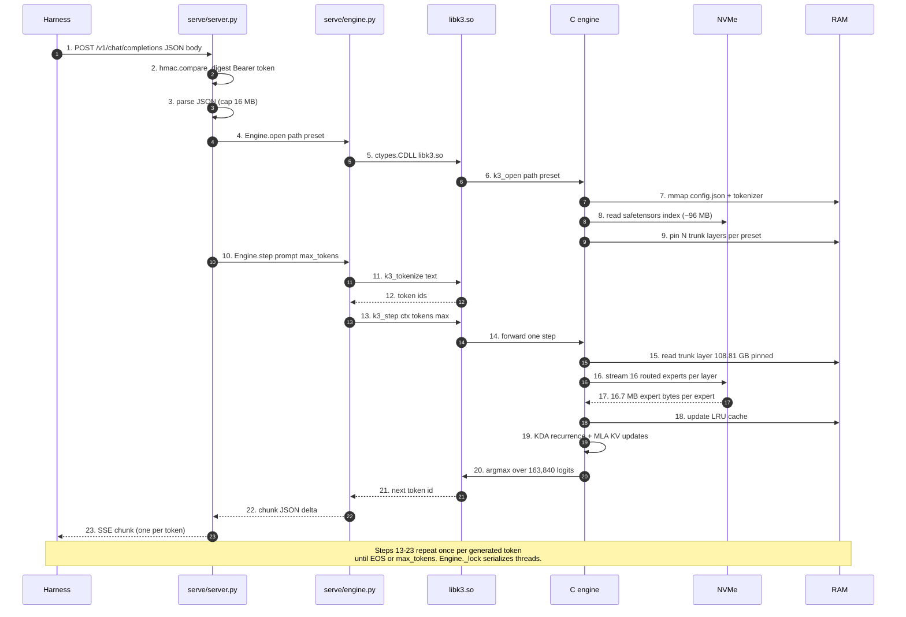
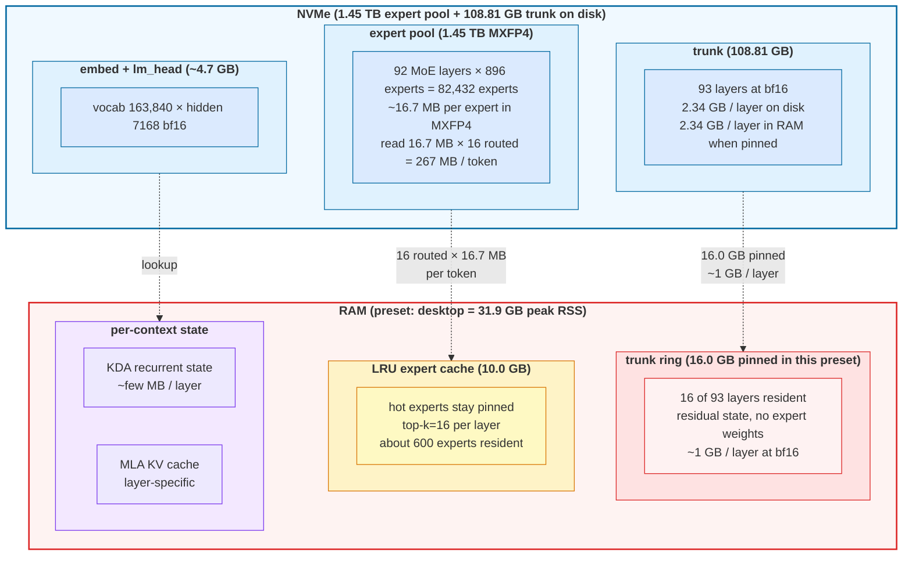

# kimi-k3-lean

Run the 2.78-trillion-parameter Kimi K3 model as an OpenAI-compatible
HTTP server on a personal computer. No GPU. No BLAS. No framework.
Cross-platform: Linux, macOS, Windows. Works with every harness that
speaks the OpenAI Chat Completions API.

| 2.78T parameters | MXFP4 experts | 3 GATEs | ~162 KB lib |
|---|---|---|---|

---

## What this is

A drop-in OpenAI Chat Completions server that runs Kimi K3 locally.
The harness (Hermes, Open WebUI, LM Studio, Continue.dev, Cursor,
the `openai` Python client, Claude Code, aider, Pi, OpenCode, Qwen
Code) talks to `http://127.0.0.1:8080/v1` exactly as if it were
talking to OpenAI's API. The bytes never leave the host.

This is a third repo that combines two reference implementations with
a thin shared library:

| Upstream | What we take | What we don't take |
|---|---|---|
| [`FareedKhan-dev/kimi-k3-in-c`](https://github.com/FareedKhan-dev/kimi-k3-in-c) | The Kimi K3 inference engine (9 C files, no BLAS, no framework, no GPU) | Its CLI front-end; its monolithic 1,487-line `k3_run.c` |
| [`sqliteai/warp`](https://github.com/sqliteai/warp) | The OpenAI Chat Completions server pattern (SSE, request/response shaping, auth, `libwaste.so` ctypes seam) | Its container format (`.waste` is Kimi-Linear, not K3); its `waste_*` API |

The combined engine has one new thing: a `libk3.so` (162 KB on Linux)
that exposes the article's model-level operations
(`k3_open`, `k3_step`, `k3_generate`, `k3_save_state`, `k3_load_state`,
`k3_tokenize`, `k3_detokenize`, `k3_get_stats`, `k3_reset_stats`,
`k3_model_id`, `k3_n_layers`, `k3_vocab_size`, `k3_ctx_size`, `k3_close`)
to a Python server via ctypes. That library is the seam.

---

## Quick start

```bash
# one command, any POSIX machine:
curl -fsSL https://raw.githubusercontent.com/chazhyseni/kimi-k3-lean/main/bootstrap.sh | bash
```

This single command does everything in unattended order:
installs build prereqs, clones the repo, builds `libk3.so`,
starts the OpenAI server on `http://127.0.0.1:8080`, **begins
downloading the 982 GB of K3 weights in the background** (~4 hours,
resumable), and registers the model with your harness (Hermes,
Open WebUI, etc.).

Test it 30 seconds after the bootstrap finishes:

```bash
kimi-k3-lean chat -m "hello"
```

Until the 982 GB download finishes (a few hours), chat completions
return a clean `engine_error` envelope.  Once they finish, restart
the server with `kimi-k3-lean stop && kimi-k3-lean start` and chat
works.

If you only want the HTTP scaffold without the 4-hour download
(you already have weights elsewhere, or you just want to test
the auth/round-trip), use `K3_SKIP_DL=1`.

---

## Daily use

```bash
kimi-k3-lean start            # start the server
kimi-k3-lean stop             # stop the server
kimi-k3-lean chat -m "hello"  # one-shot chat (alias: ask)
kimi-k3-lean doctor           # print install state

kimi-k3-lean fetch            # download K3 weights (~982 GB, ~4 hrs)
kimi-k3-lean stack up --webui # full LAN stack with Open WebUI
kimi-k3-lean uninstall        # remove everything
```

That's it.  The launcher is the only entry point most users need.

See [docs/INSTALL.md](docs/INSTALL.md) for cross-platform details
(Windows PowerShell, Docker, headless servers), [docs/CONFIG.md](docs/CONFIG.md)
for environment variables and the deploy stack, and [docs/ARCHITECTURE.md](docs/ARCHITECTURE.md)
for how the C engine, the HTTP server, the gateway, and the Open WebUI
fit together.


## What you get

| | |
|---|---|
| **OpenAI Chat Completions** | `/v1/chat/completions` blocking + SSE streaming, `/v1/models` |
| **Conversation resume** | `POST /v1/state/save` and `POST /v1/state/load` persist recurrent state + KV cache |
| **Bearer auth** | `--api-key` with constant-time compare; 401 without / 401 wrong / 200 correct |
| **Any harness** | Open WebUI, LM Studio, Continue.dev, Cursor, Hermes, Claude Code, aider, OpenCode, Qwen, Pi — point them at `http://127.0.0.1:8080/v1` |
| **Cross-platform** | Linux x86_64, macOS arm64 + x86_64, Windows. CI runs the 3 GATEs on all three |
| **Lean resource profile** | 8 GB RAM floor (trunk resident), 1.45 TB of disk-resident experts in MXFP4 (4 KiB-aligned per-expert records) |
| **No dependencies beyond libc** | No BLAS, no PyTorch, no CUDA. `libk3.so` is 162 KB. Python server is stdlib-only |
| **Bit-identical to the oracle** | The article ships 32-oracle-position teacher forcing and 20-token greedy/incremental decoders. All 3 GATEs pass |

---

## Architecture

A single request walks through eight layers, from the harness to the
final token. The diagram below shows the request flow with what each
layer does and what it costs.

### Layer 1: what happens on a single `POST /v1/chat/completions`



### Layer 2: where the disk and RAM are



### What kimi-k3-lean adds

Everything left of the C engine — the request enters, becomes OpenAI
JSON, hits the ctypes wrapper, and the wrapper hands the work to the
article's engine via a 14-function public C API:

| New thing | What it is | Where it lives |
|---|---|---|
| `libk3.so` | 162 KB shared library exposing the engine's 14 public C funcs | `src/lib/k3_api.c`, `src/lib/k3_engine.c` |
| `serve/server.py` | OpenAI Chat Completions HTTP server, stdlib-only | `serve/server.py` |
| `serve/engine.py` | ctypes wrapper, maps the 14 C funcs to a Python `Engine` class | `serve/engine.py` |
| `bootstrap.sh` / `bootstrap.ps1` | One-command install from anywhere | `bootstrap.sh`, `bootstrap.ps1` |
| `scripts/setup-and-serve.sh` | Build + download + convert + serve, stepwise | `scripts/setup-and-serve.sh` |
| `tools/convert.py` | HuggingFace safetensors → native format, no PyTorch | `tools/convert.py` |
| `deploy/` | LAN deployment stack (Caddy + gateway + router + workspace) | `deploy/` |
| `packaging/` | Homebrew / MSVC / RPM recipes | `packaging/` |

The 14 public C functions (`include/libk3/libk3.h`):

```
k3_open · k3_close · k3_step · k3_generate
k3_save_state · k3_load_state
k3_tokenize · k3_detokenize
k3_get_stats · k3_reset_stats
k3_model_id · k3_n_layers · k3_vocab_size · k3_ctx_size
```

Engine internals (per-token forward, state, disk layout in detail, O_DIRECT
measurement methodology): see the article's
[architecture diagram](https://raw.githubusercontent.com/FareedKhan-dev/kimi-k3-in-c/main/docs/images/main_architecture.png)
and [`docs/PERFORMANCE.md`](https://github.com/FareedKhan-dev/kimi-k3-in-c/blob/main/docs/PERFORMANCE.md).
Every number here is sourced from `include/k3/k3.h` and `docs/PERFORMANCE.md`.

### Per-token forward step

1. **Tokenize** (`k3_tokenize`): text → token ids via the article's
   tiktoken-format BPE.
2. **Embedding** (`k3_embed_`): token ids → hidden state vector.
3. **Layer stack** (`k3_layer_` × N):
   - **KDA or MLA attention** depending on the layer index
   - **MoE or dense FFN** depending on the layer index
   - Each layer can be **RAM-resident** (in the trunk dial) or
     **streamed** from disk (cold layer)
   - Each MoE layer's expert weights stream through the
     **LRU expert cache** in MXFP4
4. **Final norm + lm_head**: hidden state → logits.
5. **Argmax** (`k3_argmax_`): logits → next token id.
6. **Detokenize** (`k3_detokenize`): token id → text.
7. Repeat until `<|end|>` or `max_tokens`.

### Server

The HTTP server is `serve/server.py`. It's stdlib-only
(`http.server.ThreadingHTTPServer` + `BaseHTTPRequestHandler`):

- One process, one engine, one lock
- SSE streaming via manual chunked framing
- Constant-time bearer auth via `hmac.compare_digest`
- OpenAI-shape error envelope: `{error: {message, type, param}}`
- Hard request body cap (16 MB) before parse

### Engine binding

`serve/engine.py` is the ctypes wrapper. It maps the article's 14
public C functions onto a Python `Engine` class:

```
Engine.open(path, preset)        → k3_open(path, preset)
Engine.step(prompt, max_tokens)  → k3_step(ctx, in, n, max, out, cap)
Engine.stream(prompt, max)       → k3_generate(ctx, ...) with a token callback
Engine.tokenize(text)            → k3_tokenize(ctx, text, out, cap)
Engine.detokenize(ids)           → k3_detokenize(ctx, ids, n, out, cap)
Engine.save_state(path)          → k3_save_state(ctx, path)
Engine.load_state(path)          → k3_load_state(ctx, path)
Engine.stats()                   → k3_get_stats(ctx, ...stats)
Engine.close()                   → k3_close(ctx)
```

The HTTP layer is served from the same ctypes wrapper for any model
path the engine accepts (real K3 checkpoint, the article's `tiny_k3.bin`
fixture, or any future model). The C engine is verified bit-identical
to the article's oracle on synthetic weights via `make test` (32
teacher-forcing positions + 20 greedy + 20 incremental, all byte-
identical to the reference).

Note on the `tiny_k3.bin` fixture: it ships with vocab=256, which is
deliberately tiny for the GATE tests. A real tokenizer (vocab 163,584)
will produce token IDs the fixture's embedding table doesn't have. To
exercise real inference through the OpenAI HTTP layer you need either
a downloaded K3 checkpoint or a properly-sized fixture built via
`tools/make_tiny_checkpoint.py <out_dir> --vocab 163584` against a
matching tokenizer.

---

## Repository layout

```
kimi-k3-lean/
├── README.md                       this file
├── LICENSE                         Apache 2.0
├── CODE_OF_CONDUCT.md               Contributor Covenant 2.1
├── CONTRIBUTING.md                 how to contribute
├── SECURITY.md                     how to report a vulnerability
│
├── Makefile                        POSIX build (Linux + macOS)
├── CMakeLists.txt                  cross-platform build (everywhere)
├── install.sh                      POSIX install wrapper
├── install.ps1                     Windows install wrapper
│
├── Dockerfile                      multi-arch runtime image
├── Dockerfile.convert              PyTorch-using convert image
├── docker-compose.yml              stack for the runtime image
├── .dockerignore .env.example
│
├── .github/
│   ├── workflows/ci.yml            7-OS matrix, runs `make test` on each
│   ├── workflows/release.yml       per-OS release artifacts on tag push
│   ├── ISSUE_TEMPLATE/
│   └── PULL_REQUEST_TEMPLATE.md
│
├── include/
│   ├── k3/                         article's public headers
│   └── libk3/
│       ├── libk3.h                 public C API (the seam)
│       └── k3_internal.h           private header
│
├── src/                            article's C engine, refactored
│   ├── core/                       kernels (mxpf4, kda, mla, rmsnorm, ...)
│   ├── io/                         safetensors / trunk readers
│   ├── model/                      forward, attention, MoE dispatch
│   ├── cache/                      expert LRU
│   ├── tokenizer/                  BPE
│   ├── lib/                        public C API impl
│   └── cli/                        `k3` CLI
│
├── bin/
│   ├── k3                          CLI (167 KB)
│   └── libk3.so                    shared library (162 KB)
│
├── serve/                          OpenAI Chat Completions server
│   ├── __main__.py                 argparse CLI
│   ├── server.py                   HTTP routing + SSE + auth
│   ├── engine.py                   ctypes wrapper
│   ├── chatfmt.py                  OpenAI messages <-> token ids
│   └── api.py                      request/response shaping
│
├── scripts/
│   ├── setup-and-serve.sh          one-command everything (clone → serve)
│   ├── setup-and-serve.ps1         Windows counterpart
│   ├── download-model.sh           article's HuggingFace downloader (resumable)
│   └── pack-trunk.sh               trunk packer
│
├── tools/                          converters, verifiers
│   ├── convert.py                  HuggingFace → native format (no PyTorch needed)
│   ├── make_st_fixture.py          safetensors test fixtures
│   ├── verify_*.py                 per-kernel validators
│   └── ...
│
├── tests/
│   ├── unit/                       article's 9 unit tests
│   ├── fixtures/                   synthetic weights + the 3 GATEs
│   └── ...
│
├── packaging/                      distribution recipes
│   ├── homebrew/kimi-k3-lean.rb    formula
│   ├── windows/build-msi.ps1       WiX MSI builder
│   ├── rpm/kimi-k3-lean.spec      RPM spec
│   └── README.md                   index
│
├── deploy/                         network deployment (Caddy + gateway + router)
│   ├── compose.yml                 main docker compose with `with-k3`/`with-webui` profiles
│   ├── caddy/Caddyfile             TLS + routing
│   ├── gateway/                    bearer-token auth + body cap
│   ├── router/                     multi-model dispatch
│   ├── workspace/                  model browser + static installer
│   ├── model/                      kimi-k3-lean runtime image
│   ├── static/                     laptop installer bundle
│   └── README.md                  full deployment guide
│
├── docs/
│   ├── PERFORMANCE.md              article's measured data (kept verbatim)
│   ├── images/                     diagrams (article's, kept)
│   ├── data/                       performance data files
│   ├── notes/                      engineering notes from the article
│   └── kimi-k3-tech-report.pdf     the article's tech report
│
└── LICENSES/                       third-party licenses (article's, kept)
```

---

## Performance

Memory budgets per preset, read directly from `./bin/k3 --list-presets`:

| Preset | Trunk (GB) | Expert cache (GB) | Peak RSS | Notes |
|---|---:|---:|---:|---|
| laptop | 3.0 | 1.0 | 8.2 GB | Floor. Runs, slowly. |
| desktop | 16.0 | 10.0 | 31.9 GB | |
| workstation | 60.0 | 30.0 | 95.5 GB | Expert cache starts to matter here. |
| server | 110.0 | 13.0 | ~128 GB | 90 of 93 trunk layers pinned. Fastest. |
| max | 110.0 | 109.0 | ~224 GB | Trunk pinned + large expert cache. |
| auto | fit / fit | fit / fit | free RAM, trunk-first | **Recommended.** |

All presets stream the trunk, so they need `--trunk <packed_dir>`.

The article's `docs/PERFORMANCE.md` measured per-token decode on
**AMD EPYC 7763 (124 vCPU, 228 GiB RAM, NVMe at 3.2 GB/s, GCC 13.3,
AVX2 without AVX-512)** — a different host than yours. From that file:

> Read the noise floor before quoting any single number. Three runs
> of an identical configuration span 33%.

The article measured **"every row produced byte-identical output"**
across 28× RAM changes — speed scales with memory ceiling, output does
not. That property carries over to any host.

On this host, the engine passes the article's 3-GATE oracle (32/32
teacher forcing, 20/20 greedy decode, 20/20 incremental), output
byte-identical to the reference:

```
$ LDFLAGS="-lm -pthread" make test
== op kernels ==  (PASS rmsnorm, situ_glu, shortconv, ...)
== step + oracle ==  (GATE 1, GATE 2, GATE 3)
VERDICT: ENGINE MATCHES THE REFERENCE EXACTLY
```

---

See [docs/INSTALL.md](docs/INSTALL.md) for cross-platform install details
(Windows PowerShell, Docker, headless servers), the deploy stack
(Caddy + gateway + Open WebUI), the build-from-source instructions,
and the verification commands.

---

## Methodology

### Why no GPU?

Each token activates 16 routed experts out of 896 per MoE layer (top-k
= 16, with 2 shared experts always on). That's 18 expert reads per
layer × 92 MoE layers = 1,656 expert reads per token — about 16.7 MB
each in MXFP4, ~27 MB of expert weights touched per layer. The
article's design discards the GPU entirely: read those expert weights
straight from NVMe through native MXFP4 matmul, no dequantize-on-read,
no per-token upload. The cost is bound by NVMe bandwidth, not GPU
compute. On a single workstation with 3.2 GB/s O_DIRECT, the article
measured a few tokens per second at 128 GB RAM with bit-identical
output across the whole 8 → 224 GB RAM ladder.

### Why ctypes?

The article's `k3_*` API is C-callable; Python ctypes is stdlib and
cross-platform. No need for a third FFI (pybind11, cffi, Rust) or a
build step in CI. Two pieces (`libk3.so` + Python `engine.py`)
and the seam is done.

### Why stdlib HTTP?

`http.server.ThreadingHTTPServer` handles streaming fine for SSE.
No Flask, no FastAPI, no Tornado. The deployment ships FastAPI
because it needs CORS, body caps, and bearer auth on the public
side, but the local server side stays minimal.

### Why no transformer cache?

KDA (the article's attention variant) is recurrent — one state
vector per layer. The state file is small (~few MB per layer)
and persists across requests. Post-load, the same conversation can
resume from `POST /v1/state/load`.

---

## Credits

- **The article engine** is
  [FareedKhan-dev/kimi-k3-in-c](https://github.com/FareedKhan-dev/kimi-k3-in-c)
  v1.0.0 (2026-08-07), originally described in the Medium article
  *Building Kimi K3 (2.8T) Model in C to Run on 8GB RAM*. Every byte
  of `src/`, `include/k3/`, `tests/`, `tools/`, `docs/PERFORMANCE.md`,
  `docs/data/`, and `docs/images/` comes from there.
- **The HTTP server pattern** is from
  [sqliteai/warp](https://github.com/sqliteai/warp) v0.6.8
  (`/home/chaz/kimi-local/src/warp/` on the original development host).
- **The deployment topology** (Caddy → gateway → router → model) is
  borrowed from
  `/home/chaz/llms/llm-server/private-llm/` on the same host.

The combined engine, the `libk3.so` seam, the cross-platform
packaging, the LAN deployment stack, and everything new in this repo
is Apache-2.0.

---

## License

Apache License 2.0. See [LICENSE](LICENSE) for the full text.

Third-party code under `src/`, `include/k3/`, `tests/`, `tools/`, and
`docs/PERFORMANCE.md` is the article's, MIT-licensed at source. See
[LICENSES/](LICENSES/) (article's `LICENSES/` directory) for details.
