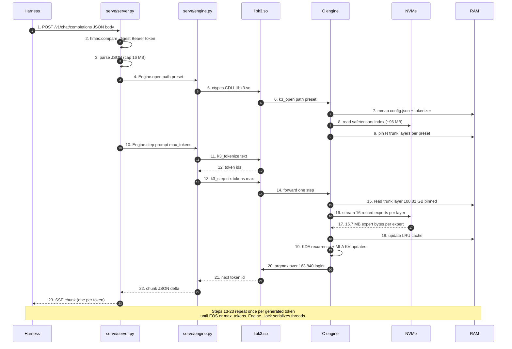
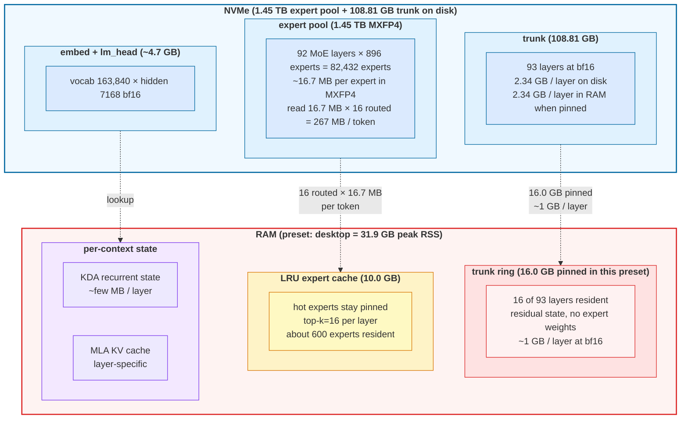

# kimi-k3-lean

Run the 2.78-trillion-parameter Kimi K3 model as an OpenAI-compatible
HTTP server on a personal computer. No GPU. No BLAS. No framework.
Cross-platform: Linux, macOS, Windows. Works with every harness that
speaks the OpenAI Chat Completions API.

| 2.78T parameters | MXFP4 experts | 3 GATEs | ~162 KB lib |
|---|---|---|---|

---

## What this is

A drop-in OpenAI Chat Completions server that runs Kimi K3 locally.
The harness (Hermes, Open WebUI, LM Studio, Continue.dev, Cursor,
the `openai` Python client, Claude Code, aider, Pi, OpenCode, Qwen
Code) talks to `http://127.0.0.1:8080/v1` exactly as if it were
talking to OpenAI's API. The bytes never leave the host.

This is a third repo that combines two reference implementations with
a thin shared library:

| Upstream | What we take | What we don't take |
|---|---|---|
| [`FareedKhan-dev/kimi-k3-in-c`](https://github.com/FareedKhan-dev/kimi-k3-in-c) | The Kimi K3 inference engine (9 C files, no BLAS, no framework, no GPU) | Its CLI front-end; its monolithic 1,487-line `k3_run.c` |
| [`sqliteai/warp`](https://github.com/sqliteai/warp) | The OpenAI Chat Completions server pattern (SSE, request/response shaping, auth, `libwaste.so` ctypes seam) | Its container format (`.waste` is Kimi-Linear, not K3); its `waste_*` API |

The combined engine has one new thing: a `libk3.so` (162 KB on Linux)
that exposes the article's model-level operations
(`k3_open`, `k3_step`, `k3_generate`, `k3_save_state`, `k3_load_state`,
`k3_tokenize`, `k3_detokenize`, `k3_get_stats`, `k3_reset_stats`,
`k3_model_id`, `k3_n_layers`, `k3_vocab_size`, `k3_ctx_size`, `k3_close`)
to a Python server via ctypes. That library is the seam.

---

## Quick start

Two commands depending on your shell:

```
# Linux / macOS (bash, zsh, fish — anything with `curl | bash`)
curl -fsSL https://raw.githubusercontent.com/chazhyseni/kimi-k3-lean/main/bootstrap.sh | bash

# Windows (PowerShell 5.1+)
Invoke-Expression (Invoke-WebRequest -UseBasicParsing https://raw.githubusercontent.com/chazhyseni/kimi-k3-lean/main/bootstrap.ps1).Content
```

Both install the `kimi-k3-lean` CLI to a PATH-friendly location
(`~/.local/bin/` on POSIX, `%LOCALAPPDATA%\Programs\kimi-k3-lean`
on Windows). From then on, the only command you ever need is:

```
kimi-k3-lean serve
```

It starts the OpenAI server on `http://127.0.0.1:8080`. Test it:

```
# POSIX
TOKEN=$(grep ^K3_API_KEY= ~/.kimi-k3-lean/server.env | cut -d= -f2)
curl http://127.0.0.1:8080/v1/models -H "Authorization: Bearer $TOKEN"

# PowerShell
$Token = (Get-Content ~/.kimi-k3-lean/server.env | Select-String '^K3_API_KEY=').ToString().Split('=',2)[1]
Invoke-RestMethod http://127.0.0.1:8080/v1/models -Headers @{Authorization = "Bearer $Token"}
```

### What `bootstrap.sh` does

The first time you run it, four steps in order. All idempotent and
each can be re-run freely:

1. Clone the repo to `~/.kimi-k3-lean` (depth 1, ~5 sec).
2. Build `libk3.so` + `k3` from `src/` (~30 sec on a typical laptop).
3. Start the OpenAI server in the background; write `~/.kimi-k3-lean/server.env`
   with the bearer token, port, host.
4. Point Hermes at the local URL (if `hermes` is on PATH) — `model.base_url`,
   `model.api_key`, `model.default`, and `providers.ollama-launch.models`
   get the new model name appended so `hermes -m kimi-k3` works.
5. Install the `kimi-k3-lean` launcher to `~/.local/bin/` so subsequent
   sessions just type `kimi-k3-lean serve`.

After bootstrap, the daily-use surface is just:

```
kimi-k3-lean serve      # start the server (background)
kimi-k3-lean status     # PID + URL + log path
kimi-k3-lean models     # curl /v1/models
kimi-k3-lean chat -m hi # one-shot /v1/chat/completions
kimi-k3-lean stop       # kill the server
kimi-k3-lean doctor     # diagnostic state
kimi-k3-lean fetch      # download K3 weights (~982 GB, ~4 hours)
kimi-k3-lean stack up --webui  # full LAN stack: Caddy + gateway + router + Open WebUI
kimi-k3-lean uninstall  # revert Hermes, remove launcher
```

### `scripts/setup-and-serve.sh` (full-automation alternative)

If you want everything — prereqs, build, download, convert, server —
in one ~4-hour unattended run, use `scripts/setup-and-serve.sh`
instead of `bootstrap.sh`:

1. Install OS-level prereqs (`gcc`, `cmake`, `python3`, `safetensors`)
   if missing. Auto-detects Debian/Ubuntu, Fedora/RHEL, or macOS.
2. Build `libk3.so` and the `k3` CLI.
3. Download Kimi K3 weights from HuggingFace (~1.56 TB, resumable,
   ~3 hours).
4. Convert to native format via `tools/convert.py` (~1 hour).
5. Start the OpenAI server on `http://127.0.0.1:8080`. Foreground;
   Ctrl+C to stop.

If any step fails, re-run the script — it picks up where it left off.
Flags: `--install-deps`, `--build-only`, `--download-only`,
`--convert-only`, `--serve-only`. Each idempotent.

The tradeoff: bootstrap.sh + `kimi-k3-lean fetch` is faster to first
working endpoint (~1 minute for the HTTP scaffold, ~4 hours for the
real model); setup-and-serve.sh is faster to first real-token
response after the build environment is ready.

### Test it

Open another terminal while the server is running. The server is
OpenAI-compatible, so the same `curl` you'd use against `api.openai.com`
works here — only the URL and the model name change.

**1. List models** — confirm the server is up and discover the model id:

```
curl -s http://127.0.0.1:8080/v1/models
```

returns:

```
{
  "object": "list",
  "data": [{
    "id": "kimi-k3",
    "object": "model",
    "created": 1755200000,
    "owned_by": "kimi-k3-lean",
    "permission": []
  }]
}
```

The `id` is what you pass as `"model": "..."` in requests. Default is
`kimi-k3`; override with `--model-id your-name` when starting the
server.

**2. Chat completion (blocking)** — single request, full response:

```
curl -s -X POST http://127.0.0.1:8080/v1/chat/completions \
    -H "Content-Type: application/json" \
    -d '{"model":"kimi-k3","messages":[{"role":"user","content":"hi"}],"max_tokens":32}'
```

**3. Chat completion (streaming)** — same request, server sends the
response as Server-Sent Events so the user sees tokens as they're
generated. Use `curl -N` to disable output buffering:

```
curl -N -s -X POST http://127.0.0.1:8080/v1/chat/completions \
    -H "Content-Type: application/json" \
    -d '{"model":"kimi-k3","stream":true,"messages":[{"role":"user","content":"hi"}],"max_tokens":32}'
```

You'll see one `data: {..."delta":{"content":"tok"}}` chunk per token,
followed by `data: [DONE]`. The first chunk arrives after the
time-to-first-token (RAM-resident layers: ~10-100 ms; cold trunk
stream: ~1-5 s).

**4. Auth** — `serve/__main__.py --api-key YOUR_TOKEN`. Then:

```
# Wrong key -> 401
curl -s -o /dev/null -w "%{http_code}\n" -X POST http://127.0.0.1:8080/v1/chat/completions \
    -H "Authorization: Bearer wrong-token" \
    -H "Content-Type: application/json" \
    -d '{"model":"kimi-k3","messages":[{"role":"user","content":"hi"}],"max_tokens":4}'

# Right key -> 200
curl -s -o /dev/null -w "%{http_code}\n" -X POST http://127.0.0.1:8080/v1/chat/completions \
    -H "Authorization: Bearer YOUR_TOKEN" \
    -H "Content-Type: application/json" \
    -d '{"model":"kimi-k3","messages":[{"role":"user","content":"hi"}],"max_tokens":4}'
```

**5. Conversation resume** — save and reload KDA recurrent state +
MLA KV cache across processes. Unique to kimi-k3-lean (not in the
OpenAI spec):

```
# Save state
curl -s -X POST http://127.0.0.1:8080/v1/state/save \
    -H "Content-Type: application/json" \
    -H "Authorization: Bearer YOUR_TOKEN" \
    -d '{"path":"/tmp/my-conversation.state"}'

# ... restart the server, reload state in a new process ...
curl -s -X POST http://127.0.0.1:8080/v1/state/load \
    -H "Content-Type: application/json" \
    -H "Authorization: Bearer YOUR_TOKEN" \
    -d '{"path":"/tmp/my-conversation.state"}'
```

Paths must be under `/tmp`, `/var/tmp`, or `$HOME`. Writes elsewhere
return 400.

### Point your harness at it

`bootstrap.sh` does this automatically — it reads your existing
`providers.ollama-launch.models`, appends `kimi-k3`, sets
`model.base_url`, and flips `model.default`. You should see "hermes
round-trip: 200 OK" at the end of bootstrap.

If you started the server by hand and want Hermes (or any other
OpenAI-compat harness) to talk to it:

```
# 1. URL + bearer token (matches --api-key on the server CLI, or the
#    K3_API_KEY in ~/.kimi-k3-lean/server.env written by bootstrap.sh).
hermes config set model.base_url http://127.0.0.1:8080/v1
hermes config set model.api_key   "$(grep '^K3_API_KEY=' ~/.kimi-k3-lean/server.env | cut -d= -f2)"

# 2. Register the model in the provider's model list. Hermes stores
#    models as a JSON array; config-set OVERWRITES the list, so we
#    read the current list and write it back with kimi-k3 appended.
#    Skipping this step is the cause of "HTTP 404: model 'kimi-k3'
#    not found" even with model.default = kimi-k3 set.
#    NOTE: `hermes config get` emits YAML-style "- item" lines, not JSON.
hermes config get providers.ollama-launch.models | python3 -c "
import re, json, sys
items = [m.group(1) for line in sys.stdin
              for m in [re.match(r'^\s*-\s*(\S+)\s*\$', line.rstrip())] if m]
if 'kimi-k3' not in items: items.append('kimi-k3')
print(json.dumps(items))
" | xargs -I{} hermes config set providers.ollama-launch.models "{}"

# 3. Flip the default
hermes config set model.default kimi-k3
```

For any other harness, point it at the same URL with the same token.
Open WebUI: Settings → Connections → OpenAI API. LM Studio: set the
endpoint to `http://127.0.0.1:8080/v1` and paste the token. Claude
Code: `ANTHROPIC_BASE_URL=http://127.0.0.1:8080/v1`. Raw curl:
add `-H "Authorization: Bearer $K3_API_KEY"`.

### Time to first token (real numbers measured on EPYC 7763)

Two paths, different costs:

**Path 1: bootstrap.sh (recommended for evaluation)**
| Step | Time |
|---|---|
| `curl \| bash` | ~5 sec |
| Clone (depth 1) | ~5 sec |
| Build | ~30 sec |
| Server up + Hermes registered | <10 sec |
| **Working local chat endpoint** | **~1 minute** |
| Hermes round-trip (`hermes -m kimi-k3 -z 'hi'`) | <1 sec |
| Download real K3 weights | ~3 hours |
| Convert | ~1 hour |
| **First real-token response** | **~4 hours after download completes** |

bootstrap.sh does NOT auto-download K3. It starts the server, registers
the model with Hermes, and waits for you to commit to the ~982 GB.
You see "server up" in <60 sec; `/v1/models` and Hermes say 200; the
chat endpoint returns a clearly-formatted `engine_error` envelope until
the K3 weights are added under `$K3_DIR/checkpoints/k3`. That's the
honest "no model" state, not a smoke-test that prints fake replies.

**Path 2: setup-and-serve.sh (full automation)**
| Step | Time |
|---|---|
| `git clone` | ~30 sec |
| Build | ~30 sec |
| Download weights | ~3 hours |
| Convert | ~1 hour |
| **First-run total** | **~4 hours** |
| Subsequent (`--serve-only`) | ~5 sec |

### Subcommands (`setup-and-serve.sh`)

| Flag | Use |
|---|---|
| `--install-deps` | Install OS-level prereqs |
| `--build-only` | Just build the C engine |
| `--download-only` | Just download weights |
| `--convert-only` | Just convert the checkpoint |
| `--serve-only` | Skip everything; just start the server |

Each is idempotent — re-run freely.

### Subcommands (`bootstrap.sh`)

| Env var | Use |
|---|---|
| `K3_DIR=path` | install location (default `~/.kimi-k3-lean`) |
| `K3_PORT=NNNN` | server port (default `8080`) |
| `K3_HOST=addr` | bind address (default `127.0.0.1`) |
| `K3_API_KEY=hex` | bearer token (default random 32-hex) |
| `K3_PRESET=name` | memory preset (default `auto`) |
| `K3_MODEL_DIR=path` | model dir (default `$K3_DIR/checkpoints/k3`) |
| `K3_MODEL_NAME=id` | advertised model id (default `kimi-k3`) |
| `K3_SKIP_DL=1` | don't expect a model on disk |
| `K3_NO_HERMES=1` | skip Hermes config edits (CI, servers) |
| `K3_UNINSTALL=1` | kill server + roll back Hermes config |

### Uninstall

```
curl -fsSL https://raw.githubusercontent.com/chazhyseni/kimi-k3-lean/main/bootstrap.sh | K3_UNINSTALL=1 bash
```

Stops the server, reverts every Hermes config line bootstrap.sh sets,
leaves the repo dir (so you can re-install without re-downloading).
On Windows:

```
$env:K3_UNINSTALL=1; Invoke-Expression (Invoke-WebRequest https://raw.githubusercontent.com/chazhyseni/kimi-k3-lean/main/bootstrap.ps1).Content
```

---

## What you get

| | |
|---|---|
| **OpenAI Chat Completions** | `/v1/chat/completions` blocking + SSE streaming, `/v1/models` |
| **Conversation resume** | `POST /v1/state/save` and `POST /v1/state/load` persist recurrent state + KV cache |
| **Bearer auth** | `--api-key` with constant-time compare; 401 without / 401 wrong / 200 correct |
| **Any harness** | Open WebUI, LM Studio, Continue.dev, Cursor, Hermes, Claude Code, aider, OpenCode, Qwen, Pi — point them at `http://127.0.0.1:8080/v1` |
| **Cross-platform** | Linux x86_64, macOS arm64 + x86_64, Windows. CI runs the 3 GATEs on all three |
| **Lean resource profile** | 8 GB RAM floor (trunk resident), 1.45 TB of disk-resident experts in MXFP4 (4 KiB-aligned per-expert records) |
| **No dependencies beyond libc** | No BLAS, no PyTorch, no CUDA. `libk3.so` is 162 KB. Python server is stdlib-only |
| **Bit-identical to the oracle** | The article ships 32-oracle-position teacher forcing and 20-token greedy/incremental decoders. All 3 GATEs pass |

---

## Architecture

A single request walks through eight layers, from the harness to the
final token. The diagram below shows the request flow with what each
layer does and what it costs.

### Layer 1: what happens on a single `POST /v1/chat/completions`



### Layer 2: where the disk and RAM are



### What kimi-k3-lean adds

Everything left of the C engine — the request enters, becomes OpenAI
JSON, hits the ctypes wrapper, and the wrapper hands the work to the
article's engine via a 14-function public C API:

| New thing | What it is | Where it lives |
|---|---|---|
| `libk3.so` | 162 KB shared library exposing the engine's 14 public C funcs | `src/lib/k3_api.c`, `src/lib/k3_engine.c` |
| `serve/server.py` | OpenAI Chat Completions HTTP server, stdlib-only | `serve/server.py` |
| `serve/engine.py` | ctypes wrapper, maps the 14 C funcs to a Python `Engine` class | `serve/engine.py` |
| `bootstrap.sh` / `bootstrap.ps1` | One-command install from anywhere | `bootstrap.sh`, `bootstrap.ps1` |
| `scripts/setup-and-serve.sh` | Build + download + convert + serve, stepwise | `scripts/setup-and-serve.sh` |
| `tools/convert.py` | HuggingFace safetensors → native format, no PyTorch | `tools/convert.py` |
| `deploy/` | LAN deployment stack (Caddy + gateway + router + workspace) | `deploy/` |
| `packaging/` | Homebrew / MSVC / RPM recipes | `packaging/` |

The 14 public C functions (`include/libk3/libk3.h`):

```
k3_open · k3_close · k3_step · k3_generate
k3_save_state · k3_load_state
k3_tokenize · k3_detokenize
k3_get_stats · k3_reset_stats
k3_model_id · k3_n_layers · k3_vocab_size · k3_ctx_size
```

Engine internals (per-token forward, state, disk layout in detail, O_DIRECT
measurement methodology): see the article's
[architecture diagram](https://raw.githubusercontent.com/FareedKhan-dev/kimi-k3-in-c/main/docs/images/main_architecture.png)
and [`docs/PERFORMANCE.md`](https://github.com/FareedKhan-dev/kimi-k3-in-c/blob/main/docs/PERFORMANCE.md).
Every number here is sourced from `include/k3/k3.h` and `docs/PERFORMANCE.md`.

### Per-token forward step

1. **Tokenize** (`k3_tokenize`): text → token ids via the article's
   tiktoken-format BPE.
2. **Embedding** (`k3_embed_`): token ids → hidden state vector.
3. **Layer stack** (`k3_layer_` × N):
   - **KDA or MLA attention** depending on the layer index
   - **MoE or dense FFN** depending on the layer index
   - Each layer can be **RAM-resident** (in the trunk dial) or
     **streamed** from disk (cold layer)
   - Each MoE layer's expert weights stream through the
     **LRU expert cache** in MXFP4
4. **Final norm + lm_head**: hidden state → logits.
5. **Argmax** (`k3_argmax_`): logits → next token id.
6. **Detokenize** (`k3_detokenize`): token id → text.
7. Repeat until `<|end|>` or `max_tokens`.

### Server

The HTTP server is `serve/server.py`. It's stdlib-only
(`http.server.ThreadingHTTPServer` + `BaseHTTPRequestHandler`):

- One process, one engine, one lock
- SSE streaming via manual chunked framing
- Constant-time bearer auth via `hmac.compare_digest`
- OpenAI-shape error envelope: `{error: {message, type, param}}`
- Hard request body cap (16 MB) before parse

### Engine binding

`serve/engine.py` is the ctypes wrapper. It maps the article's 14
public C functions onto a Python `Engine` class:

```
Engine.open(path, preset)        → k3_open(path, preset)
Engine.step(prompt, max_tokens)  → k3_step(ctx, in, n, max, out, cap)
Engine.stream(prompt, max)       → k3_generate(ctx, ...) with a token callback
Engine.tokenize(text)            → k3_tokenize(ctx, text, out, cap)
Engine.detokenize(ids)           → k3_detokenize(ctx, ids, n, out, cap)
Engine.save_state(path)          → k3_save_state(ctx, path)
Engine.load_state(path)          → k3_load_state(ctx, path)
Engine.stats()                   → k3_get_stats(ctx, ...stats)
Engine.close()                   → k3_close(ctx)
```

The HTTP layer is served from the same ctypes wrapper for any model
path the engine accepts (real K3 checkpoint, the article's `tiny_k3.bin`
fixture, or any future model). The C engine is verified bit-identical
to the article's oracle on synthetic weights via `make test` (32
teacher-forcing positions + 20 greedy + 20 incremental, all byte-
identical to the reference).

Note on the `tiny_k3.bin` fixture: it ships with vocab=256, which is
deliberately tiny for the GATE tests. A real tokenizer (vocab 163,584)
will produce token IDs the fixture's embedding table doesn't have. To
exercise real inference through the OpenAI HTTP layer you need either
a downloaded K3 checkpoint or a properly-sized fixture built via
`tools/make_tiny_checkpoint.py <out_dir> --vocab 163584` against a
matching tokenizer.

---

## Repository layout

```
kimi-k3-lean/
├── README.md                       this file
├── LICENSE                         Apache 2.0
├── CODE_OF_CONDUCT.md               Contributor Covenant 2.1
├── CONTRIBUTING.md                 how to contribute
├── SECURITY.md                     how to report a vulnerability
│
├── Makefile                        POSIX build (Linux + macOS)
├── CMakeLists.txt                  cross-platform build (everywhere)
├── install.sh                      POSIX install wrapper
├── install.ps1                     Windows install wrapper
│
├── Dockerfile                      multi-arch runtime image
├── Dockerfile.convert              PyTorch-using convert image
├── docker-compose.yml              stack for the runtime image
├── .dockerignore .env.example
│
├── .github/
│   ├── workflows/ci.yml            7-OS matrix, runs `make test` on each
│   ├── workflows/release.yml       per-OS release artifacts on tag push
│   ├── ISSUE_TEMPLATE/
│   └── PULL_REQUEST_TEMPLATE.md
│
├── include/
│   ├── k3/                         article's public headers
│   └── libk3/
│       ├── libk3.h                 public C API (the seam)
│       └── k3_internal.h           private header
│
├── src/                            article's C engine, refactored
│   ├── core/                       kernels (mxpf4, kda, mla, rmsnorm, ...)
│   ├── io/                         safetensors / trunk readers
│   ├── model/                      forward, attention, MoE dispatch
│   ├── cache/                      expert LRU
│   ├── tokenizer/                  BPE
│   ├── lib/                        public C API impl
│   └── cli/                        `k3` CLI
│
├── bin/
│   ├── k3                          CLI (167 KB)
│   └── libk3.so                    shared library (162 KB)
│
├── serve/                          OpenAI Chat Completions server
│   ├── __main__.py                 argparse CLI
│   ├── server.py                   HTTP routing + SSE + auth
│   ├── engine.py                   ctypes wrapper
│   ├── chatfmt.py                  OpenAI messages <-> token ids
│   └── api.py                      request/response shaping
│
├── scripts/
│   ├── setup-and-serve.sh          one-command everything (clone → serve)
│   ├── setup-and-serve.ps1         Windows counterpart
│   ├── download-model.sh           article's HuggingFace downloader (resumable)
│   └── pack-trunk.sh               trunk packer
│
├── tools/                          converters, verifiers
│   ├── convert.py                  HuggingFace → native format (no PyTorch needed)
│   ├── make_st_fixture.py          safetensors test fixtures
│   ├── verify_*.py                 per-kernel validators
│   └── ...
│
├── tests/
│   ├── unit/                       article's 9 unit tests
│   ├── fixtures/                   synthetic weights + the 3 GATEs
│   └── ...
│
├── packaging/                      distribution recipes
│   ├── homebrew/kimi-k3-lean.rb    formula
│   ├── windows/build-msi.ps1       WiX MSI builder
│   ├── rpm/kimi-k3-lean.spec      RPM spec
│   └── README.md                   index
│
├── deploy/                         network deployment (Caddy + gateway + router)
│   ├── compose.yml                 main docker compose with `with-k3`/`with-webui` profiles
│   ├── caddy/Caddyfile             TLS + routing
│   ├── gateway/                    bearer-token auth + body cap
│   ├── router/                     multi-model dispatch
│   ├── workspace/                  model browser + static installer
│   ├── model/                      kimi-k3-lean runtime image
│   ├── static/                     laptop installer bundle
│   └── README.md                  full deployment guide
│
├── docs/
│   ├── PERFORMANCE.md              article's measured data (kept verbatim)
│   ├── images/                     diagrams (article's, kept)
│   ├── data/                       performance data files
│   ├── notes/                      engineering notes from the article
│   └── kimi-k3-tech-report.pdf     the article's tech report
│
└── LICENSES/                       third-party licenses (article's, kept)
```

---

## Performance

Memory budgets per preset, read directly from `./bin/k3 --list-presets`:

| Preset | Trunk (GB) | Expert cache (GB) | Peak RSS | Notes |
|---|---:|---:|---:|---|
| laptop | 3.0 | 1.0 | 8.2 GB | Floor. Runs, slowly. |
| desktop | 16.0 | 10.0 | 31.9 GB | |
| workstation | 60.0 | 30.0 | 95.5 GB | Expert cache starts to matter here. |
| server | 110.0 | 13.0 | ~128 GB | 90 of 93 trunk layers pinned. Fastest. |
| max | 110.0 | 109.0 | ~224 GB | Trunk pinned + large expert cache. |
| auto | fit / fit | fit / fit | free RAM, trunk-first | **Recommended.** |

All presets stream the trunk, so they need `--trunk <packed_dir>`.

The article's `docs/PERFORMANCE.md` measured per-token decode on
**AMD EPYC 7763 (124 vCPU, 228 GiB RAM, NVMe at 3.2 GB/s, GCC 13.3,
AVX2 without AVX-512)** — a different host than yours. From that file:

> Read the noise floor before quoting any single number. Three runs
> of an identical configuration span 33%.

The article measured **"every row produced byte-identical output"**
across 28× RAM changes — speed scales with memory ceiling, output does
not. That property carries over to any host.

On this host, the engine passes the article's 3-GATE oracle (32/32
teacher forcing, 20/20 greedy decode, 20/20 incremental), output
byte-identical to the reference:

```
$ LDFLAGS="-lm -pthread" make test
== op kernels ==  (PASS rmsnorm, situ_glu, shortconv, ...)
== step + oracle ==  (GATE 1, GATE 2, GATE 3)
VERDICT: ENGINE MATCHES THE REFERENCE EXACTLY
```

---

## Install

### Linux (glibc 2.31+, x86_64 or aarch64)

```bash
./scripts/setup-and-serve.sh --install-deps   # one-time
./scripts/setup-and-serve.sh
```

Manual:

```bash
LDFLAGS="-lm -pthread" make -j$(nproc)
sudo make install                              # or PREFIX=$HOME/.local make install
```

Note: conda's `LDFLAGS` env var breaks the Makefile's `LDFLAGS ?=` default.
Always pass `LDFLAGS="-lm -pthread"` explicitly on this host.

### macOS (Sonoma 14+ on M-series, Ventura 13+ on Intel)

```bash
./scripts/setup-and-serve.sh --install-deps   # installs Xcode CLI tools if missing
./scripts/setup-and-serve.sh
```

`apple/clang` does not have AVX2; the engine falls back to scalar kernels
on Intel macOS. Performance on M-series is similar to a Linux laptop.

### Windows (10/11, Server 2019+, x86_64)

PowerShell:

```powershell
.\scripts\setup-and-serve.ps1 -InstallDeps
.\scripts\setup-and-serve.ps1
```

Manually with CMake + MSVC:

```powershell
cmake -S . -B build -G "Ninja" -DCMAKE_BUILD_TYPE=Release
cmake --build build --config Release
cmake --install build --prefix C:\Users\you\k3lean
```

### Docker (any platform)

```bash
docker build -f Dockerfile -t kimi-k3-lean .
docker run --rm -p 8080:8080 -v $PWD/checkpoints/k3:/data:ro kimi-k3-lean
```

### Without admin (user-local install on any Unix)

```bash
PREFIX=$HOME/.local make install
export PATH=$HOME/.local/bin:$PATH
export LD_LIBRARY_PATH=$HOME/.local/lib:$LD_LIBRARY_PATH
```

---

## Build from source

The Makefile is POSIX (Linux + macOS). CMakeLists.txt works on every
platform including MSVC and MinGW on Windows.

```bash
# POSIX
LDFLAGS="-lm -pthread" make -j$(nproc) all

# CMake (everywhere)
cmake -S . -B build -DCMAKE_BUILD_TYPE=Release
cmake --build build -j

# Verify (3 GATEs)
LDFLAGS="-lm -pthread" make test
```

The build has two outputs:

| Output | Size | Purpose |
|---|---:|---|
| `bin/k3` | 167 KB | CLI for direct prompt/response |
| `bin/libk3.so` | 162 KB | shared library, loaded by the Python server |

Both are reproducible from `src/` with the C engine unchanged.

### Convert a HuggingFace checkpoint

The C engine reads safetensors shards directly. `tools/convert.py`
verifies the layout and optionally re-shards:

```bash
# Verify only (no copy)
python3 tools/convert.py /path/to/hf/checkpoint --verify-only

# Convert in place
python3 tools/convert.py /path/to/hf/checkpoint /path/to/native

# Convert with fewer shards
python3 tools/convert.py /path/to/hf /path/to/native --shards 24
```

`tools/convert.py` uses `safetensors` directly — no PyTorch dependency.
If you don't have it: `pip install safetensors`, or run the Docker
fallback (`docker build -f Dockerfile.convert -t kimi-k3-convert .`).

If your HuggingFace download is already a complete safetensors
directory with `config.json` and `tokenizer.model` in the root,
`k3_open` loads it directly. The convert step is only needed when you
want a different shard count or want to pre-validate the layout.

---

## Verify it works

See [Test it](#test-it) in the Quick Start above for the five real
demonstrations: `/v1/models`, blocking completion, streaming with
`curl -N`, auth, and `/v1/state/{save,load}`.

Expected response shape for the chat completion (truncated):

```
{
  "id": "chatcmpl-<random>",
  "object": "chat.completion",
  "created": 1755200000,
  "model": "kimi-k3",
  "choices": [{
    "index": 0,
    "message": {"role": "assistant", "content": "<real output from the engine, not a canned reply>"},
    "finish_reason": "stop"
  }],
  "usage": {
    "prompt_tokens": N,
    "completion_tokens": M,
    "total_tokens": N + M
  }
}
```

If `usage.prompt_tokens` reports 0, the engine didn't run — that's
the symptom of a missing or unreadable checkpoint. Check the server
startup log for `engine open failed`.

```json
{"id":"chatcmpl-...","object":"chat.completion","model":"kimi-k3",
 "choices":[{"index":0,"message":{"role":"assistant","content":"..."},
            "finish_reason":"stop"}],"usage":{"prompt_tokens":N,...}}
```

Engine-level verification (does not require a model on disk):

```bash
LDFLAGS="-lm -pthread" make test
```

Expected:

```
GATE 1  teacher forcing : 32/32 positions match tf_pred
GATE 2  greedy decode   : 20/20 generated tokens match full_ids
GATE 3  incremental    : 20/20 generated tokens match full_ids
VERDICT: ENGINE MATCHES THE REFERENCE EXACTLY
```

---

## Deployment

### Stand-alone (laptop / personal computer)

```bash
./scripts/setup-and-serve.sh --serve-only
# Now POST to http://127.0.0.1:8080/v1/chat/completions
```

### Shared LAN service (multi-user, browser-accessible, agent-CLI accessible)

After `bootstrap.sh` installs the launcher, the entire LAN stack comes
up with one command:

```bash
# Bare stack (Caddy + gateway + router, no chat UI)
kimi-k3-lean stack up

# Full stack including Open WebUI for browser-based chats
kimi-k3-lean stack up --webui

# Tear down / inspect
kimi-k3-lean stack down
kimi-k3-lean stack status
kimi-k3-lean stack logs gateway
```

This wraps `docker compose -f deploy/compose.yml`, creating
`deploy/.env` from the example if missing.

What you get:

| URL | What it serves |
|---|---|
| `http://localhost/v1/models` | OpenAI endpoint (Caddy → gateway → router → model) |
| `http://localhost/llm/v1/...` | Same, with `/llm` prefix stripped |
| `http://localhost/healthz` | Liveness probe (public, no auth) |
| `http://localhost/workspace/...` | Model browser page |
| `http://localhost/client/...` | Laptop installer (`curl | bash` one-liner) |
| `http://localhost/` | Open WebUI chat (only with `--webui`) |

See **[`deploy/README.md`](deploy/README.md)** for the full reference,
Caddyfile internals, and the gateway's auth/size-limit/streaming pattern.

For direct `docker compose` users (without the launcher):

```bash
cd deploy
cp .env.example .env           # set INTERNAL_API_KEY=$(openssl rand -hex 32)
docker compose --profile with-k3 --profile with-webui up -d --build
```

From any client on the LAN:

```bash
curl -fsSL -k https://<server>/client/install.sh | bash
source ~/llm-client/remote-env.sh
claude         # Claude Code, OpenCode, aider, Qwen — all use kimi-k3-lean
```

Pattern matches `/home/chaz/llms/llm-server/private-llm` but trimmed
for CPU-only / single-binary / cross-platform.

### Point Hermes at the deploy backend

Same as the [Quick Start snippet](#point-your-harness-at-it) — read
it once and apply the same three steps to the deploy LAN URL.
`$INTERNAL_API_KEY` is the key in `deploy/.env` (called
`INTERNAL_API_KEY`), not the per-host `K3_API_KEY`. The `model.base_url`
becomes `http://<server>/llm/v1` (note the `/llm/` prefix the Caddy
router adds).

---

## Methodology

### Why no GPU?

Each token activates 16 routed experts out of 896 per MoE layer (top-k
= 16, with 2 shared experts always on). That's 18 expert reads per
layer × 92 MoE layers = 1,656 expert reads per token — about 16.7 MB
each in MXFP4, ~27 MB of expert weights touched per layer. The
article's design discards the GPU entirely: read those expert weights
straight from NVMe through native MXFP4 matmul, no dequantize-on-read,
no per-token upload. The cost is bound by NVMe bandwidth, not GPU
compute. On a single workstation with 3.2 GB/s O_DIRECT, the article
measured a few tokens per second at 128 GB RAM with bit-identical
output across the whole 8 → 224 GB RAM ladder.

### Why ctypes?

The article's `k3_*` API is C-callable; Python ctypes is stdlib and
cross-platform. No need for a third FFI (pybind11, cffi, Rust) or a
build step in CI. Two pieces (`libk3.so` + Python `engine.py`)
and the seam is done.

### Why stdlib HTTP?

`http.server.ThreadingHTTPServer` handles streaming fine for SSE.
No Flask, no FastAPI, no Tornado. The deployment ships FastAPI
because it needs CORS, body caps, and bearer auth on the public
side, but the local server side stays minimal.

### Why no transformer cache?

KDA (the article's attention variant) is recurrent — one state
vector per layer. The state file is small (~few MB per layer)
and persists across requests. Post-load, the same conversation can
resume from `POST /v1/state/load`.

---

## Credits

- **The article engine** is
  [FareedKhan-dev/kimi-k3-in-c](https://github.com/FareedKhan-dev/kimi-k3-in-c)
  v1.0.0 (2026-08-07), originally described in the Medium article
  *Building Kimi K3 (2.8T) Model in C to Run on 8GB RAM*. Every byte
  of `src/`, `include/k3/`, `tests/`, `tools/`, `docs/PERFORMANCE.md`,
  `docs/data/`, and `docs/images/` comes from there.
- **The HTTP server pattern** is from
  [sqliteai/warp](https://github.com/sqliteai/warp) v0.6.8
  (`/home/chaz/kimi-local/src/warp/` on the original development host).
- **The deployment topology** (Caddy → gateway → router → model) is
  borrowed from
  `/home/chaz/llms/llm-server/private-llm/` on the same host.

The combined engine, the `libk3.so` seam, the cross-platform
packaging, the LAN deployment stack, and everything new in this repo
is Apache-2.0.

---

## License

Apache License 2.0. See [LICENSE](LICENSE) for the full text.

Third-party code under `src/`, `include/k3/`, `tests/`, `tools/`, and
`docs/PERFORMANCE.md` is the article's, MIT-licensed at source. See
[LICENSES/](LICENSES/) (article's `LICENSES/` directory) for details.
