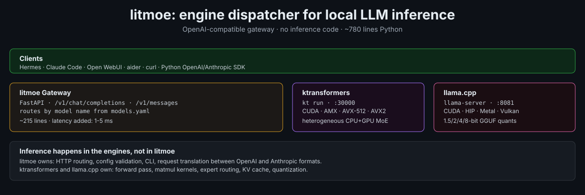

# litmoe

**lit + MoE** — a light gateway for Mixture-of-Experts models.

OpenAI-compatible gateway for [ktransformers](https://github.com/kvcache-ai/ktransformers) and [llama.cpp](https://github.com/ggml-org/llama.cpp). CPU+GPU hybrid MoE inference orchestration.

litmoe is **not an inference engine**. It is a ~1100-line Python package that:
- Reads a `models.yaml` config
- Starts the configured engines as subprocesses
- Forwards OpenAI/Anthropic-format requests to the right engine by model name
- Exposes everything at `http://127.0.0.1:8080/v1`

The actual inference is done by ktransformers or llama.cpp. litmoe adds nothing to the forward pass.

---

## What it does and why it matters

Trillion-parameter MoE models (Kimi K3, Qwen3.8-2.4T, DeepSeek-V3) are open weights but hard to run: no single tool covers all of them, each engine has a different CLI and config format, and nothing presents them behind one API. litmoe solves that with four features:

**1. One config file for every model/engine combination.** `models.yaml` lists model IDs and which engine serves them. Mix engines freely — Kimi-K3 on llama.cpp next to DeepSeek-V3 on ktransformers — and clients see one flat model list.

**2. One OpenAI + Anthropic API for everything.** `/v1/chat/completions`, `/v1/completions`, `/v1/models`, and `/v1/messages` (Anthropic format auto-translated). Point Claude Code, Hermes Agent, Open WebUI, aider, or curl at port 8080 and every configured model is reachable by name.

**3. Engine lifecycle management.** `litmoe serve` spawns each engine as a subprocess, waits for readiness, and routes traffic. `litmoe stop` shuts them down cleanly. `litmoe status` shows what is running. Engines log to per-model files under `logs/`.

**4. Hardware-aware engine selection.** `litmoe doctor` reports your CPU instruction sets (AVX2/AVX-512/AMX), RAM, and GPU, checks which engines are installed, and recommends which to use. ktransformers covers AMX/AVX-512/AVX2 CPU plus CUDA; llama.cpp covers CUDA/HIP/Metal/Vulkan/SYCL plus every quantization format.

---

## Engines

### ktransformers

**Repo:** https://github.com/kvcache-ai/ktransformers
**Authors:** MADSys Lab @ Tsinghua University + Approaching.AI
**Paper:** SOSP 2025 — "KTransformers: Unleashing the Full Potential of CPU/GPU Hybrid Inference for MoE Models"

- **GPU offloading:** Hot experts on GPU, cold experts on CPU
- **CPU kernels:** AMX (Intel Xeon 4th gen+), AVX-512, AVX2 (broad CPU compatibility)
- **Native precision:** BF16, FP8, AMXINT4/INT8
- **AVX2-only CPU backend** — works on AMD EPYC
- **Supported model families:** DeepSeek-V3/R1, GLM-5.x, MiniMax-M2.x, Kimi-K2.x, Qwen3, SmallThinker (see their model registry)

**Install:** `pip install kt-kernel`

### llama.cpp

**Repo:** https://github.com/ggml-org/llama.cpp

- CUDA, HIP (AMD), Metal (Apple), Vulkan, SYCL, OpenCL, CANN (Ascend)
- 1.5/2/3/4/5/6/8-bit quantization
- AVX, AVX2, AVX-512, AMX
- Most mature cross-platform LLM server
- **Kimi-K3**: native support via `conversion/kimi_k3.py` and `src/models/kimi-k3.cpp`
- **Qwen3.8-2.4T-A95B**: native support via `conversion/qwen.py` (Qwen3_5MoeForCausalLM) and `src/models/qwen35moe.cpp`
- Pre-quantized GGUFs available from [Unsloth](https://huggingface.co/unsloth)

**Install:** build from source or download from [releases](https://github.com/ggml-org/llama.cpp/releases)

---

## Quick start

```bash
# Install litmoe
git clone https://github.com/chazhyseni/litMoE
cd litMoE
pip install -e .

# Install an engine + download a model
litmoe install --engine llamacpp          # install llama.cpp prebuilt binary
litmoe install --model minimax-m3         # download MiniMax-M3 (128 GB, smallest viable)
# or:
litmoe install --model kimi-k3            # 594 GB
litmoe install --model qwen3.8            # 508 GB

# Start
litmoe serve

# Test
curl http://127.0.0.1:8080/v1/models
```

Full setup guide with hardware requirements, quantization options, and per-model
instructions: [docs/SETUP.md](docs/SETUP.md)

---

## Models.yaml

```yaml
host: 127.0.0.1
port: 8080
api_key: null   # or a string to require Bearer auth

models:
  # Kimi-K3 via llama.cpp (GGUF from Unsloth, 594 GB)
  - id: kimi-k3
    engine: llamacpp
    model_path: unsloth/Kimi-K3-GGUF:UD-IQ1_S
    n_gpu_layers: -1     # -1 = all, 0 = CPU only
    n_ctx: 4096

  # Qwen3.8-2.4T via llama.cpp (GGUF from Unsloth, 508 GB)
  - id: qwen3.8-2.4t
    engine: llamacpp
    model_path: unsloth/Qwen3.8-2.4T-A95B-GGUF:UD-IQ1_S
    n_gpu_layers: -1
    n_ctx: 4096

  # MiniMax-M3 via llama.cpp (GGUF from Unsloth, 128 GB — smallest viable)
  - id: minimax-m3
    engine: llamacpp
    model_path: unsloth/MiniMax-M3-GGUF:UD-IQ1_M
    n_gpu_layers: -1
    n_ctx: 4096

  # DeepSeek-V3 via ktransformers (safetensors directory)
  # - id: deepseek-v3
  #   engine: ktransformers
  #   model_path: /data/deepseek-v3
  #   n_gpu_layers: -1
  #   n_ctx: 4096
```

Per-model fields: `id` (name clients use), `engine` (`ktransformers` or `llamacpp`), `model_path` (safetensors dir, HF repo, or GGUF path), `gguf_path` (explicit GGUF override), `n_gpu_layers`, `n_ctx`, plus optional `extra_args` (list of engine CLI flags) and `env` (environment variables).

---

## Commands

```bash
litmoe doctor          # Check CPU/GPU/RAM, engine availability, get a recommendation
litmoe init            # Create models.yaml
litmoe install         # Install engines and/or download model weights
litmoe serve           # Start gateway + all configured engines
litmoe status          # Show gateway health and per-engine status
litmoe stop            # SIGTERM all engine subprocesses
```

---

## Architecture



```
   Clients (Claude Code, Hermes, Open WebUI, aider, curl)
        │  HTTP  /v1/chat/completions · /v1/messages · /v1/models
        ▼
   litmoe gateway (litmoe/server.py, ~215 lines FastAPI)
        │  parse body → read `model` field → look up engine in models.yaml
        │  Anthropic /v1/messages → translated to OpenAI chat completions
        ▼
   engine subprocess                    engine subprocess
   ktransformers.server.main :10002     llama-server :8081
        │                                     │
   GPU (sglang-kt) or CPU (AMX/AVX2)     CUDA/HIP/Metal/Vulkan/CPU
```

The gateway never touches the forward pass. It adds single-digit-millisecond latency per request and zero compute.

Full diagram with data flow, engine internals, and port table: [docs/ARCHITECTURE.md](docs/ARCHITECTURE.md) · [docs/architecture.svg](docs/architecture.svg)

Design rationale and measured performance numbers: [docs/METHODOLOGY.md](docs/METHODOLOGY.md)

---

## Connect your tools

### Claude Code
```bash
export ANTHROPIC_BASE_URL=http://127.0.0.1:8080
export ANTHROPIC_API_KEY=dummy
claude --model kimi-k3
```

### Hermes Agent
```bash
hermes config set model.provider custom
hermes config set model.base_url http://127.0.0.1:8080/v1
hermes config set model.api_key dummy
hermes config set model.default kimi-k3
```

### Open WebUI
Add an OpenAI API connection at `http://127.0.0.1:8080/v1`.

### curl
```bash
curl http://127.0.0.1:8080/v1/chat/completions -H "Content-Type: application/json" -d '{
  "model": "kimi-k3",
  "messages": [{"role": "user", "content": "hello"}]
}'
```

### Anthropic format
```bash
curl http://127.0.0.1:8080/v1/messages -H "Content-Type: application/json" -d '{
  "model": "kimi-k3",
  "max_tokens": 1024,
  "messages": [{"role": "user", "content": "hello"}]
}'
```

---

## Docker

```bash
cd deploy
cp models.yaml.example models.yaml   # edit paths first
docker compose up
```

Services: **litmoe-gateway** (port 8080), **caddy** (optional TLS proxy), **openwebui** (chat UI). Engines run as subprocesses of the gateway container or on the host.

---

## What litmoe does NOT do

- It is not an inference engine. No model weights, no forward-pass code, no kernels.
- It does not quantize models. Use `llama-quantize`, Unsloth, or download pre-quantized GGUFs.
- It does not parallelize across machines. Single-node only.

---

## License

Apache 2.0.
